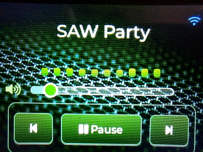

# ES3C28P-WLAN-Radio

Mini Wlan Radio, ESP32-S3

\# Mein WLAN Radio 🎧

Hier ist ein Foto von meinem fertigen Projekt:

\## Features \& Funktionen

\* \*\* Senderliste:\*\* in der senderliste.h werden die Sendernamen und die Stream-URL eingetragen.

\* \*\* Sendername:\*\* aus der senderliste.h .

\* \*\* Equalizer:\*\* Animierte, echtzeitnahe Frequenzbänder, passend zum Takt der Musik.

\## Steuerung (Buttons)

\* << Back – Vorheriger Sender

\* Play / Pause – Stream Play/Stop

\* Forward >> – Nächster Sender

\---

\*Created by Onkel Kaktus\* 🌵

